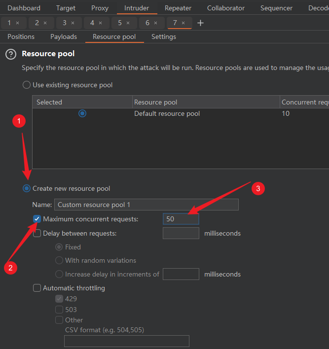

# 逻辑漏洞

## 短信轰炸漏洞挖掘

### 1. 漏洞点

任意可以发送短信邮箱验证码的地方

### 2. 绕过技巧

1. 参数后加空格,`+`

2. 参数叠加

   比如：`phone=1333333333&phone=13333333333` 有的短信轰炸需要在`&` 符号前加一个脏字符`%`

3. 修改时间参数

   比如：[时间戳](https://tool.lu/timestamp/)

4. 手机号参数头添加`+86`

5. 手机号参数后加点：`13333333333...`

   这种情况下，每加一个点可以多发一次短信，如此可以借助`bp` `Intrude`模块

6. 更换ip：使用代理池，每发一次短信更换一次ip(一般存在与内网)，或者修改xff头

7. 请求头绕过，分析请求体中用于验证的部分，更改验证字段

8. 并发绕过（可能导致ip被封）

## 并发漏洞

### 1. 漏洞高危场景

1. 领取优惠券
2. 充值
3. 提现
4. 订单支付

### 2. 工具

#### 1. Turbo Intrude

- `bp`插件模块中导入插件

  非定向爆破(单纯并发发送请求，不需要修改参数)：请求头中添加 `req: %s`

  定向爆破(需要更改请求中某些字段值)：在该字段的值处设置`%s`

- `bp`自带`Intrude`模块

  按照下图方式设置

  
